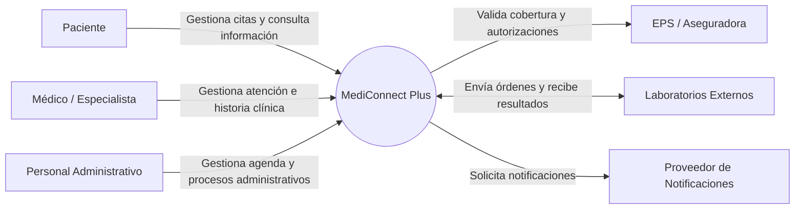
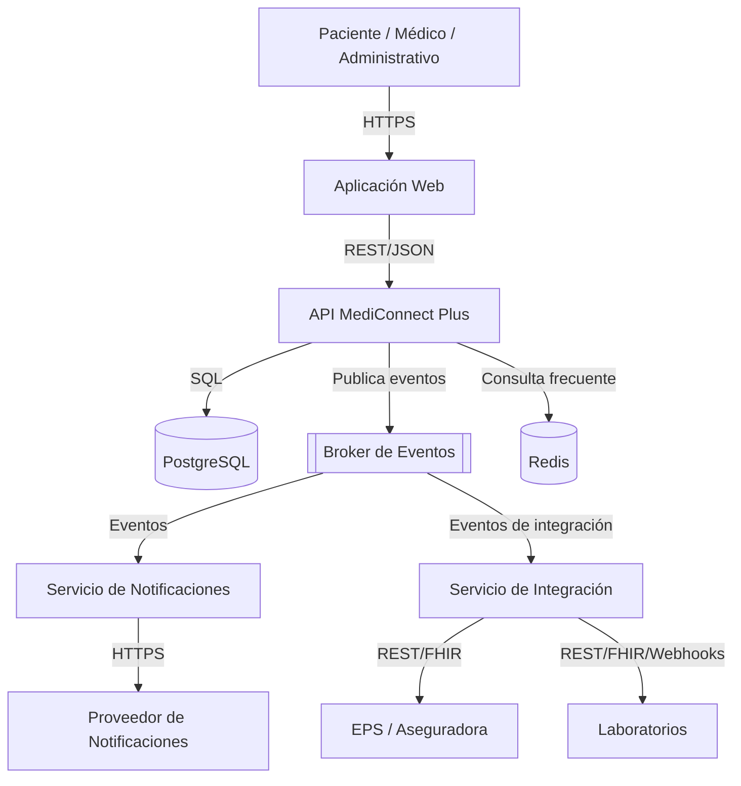
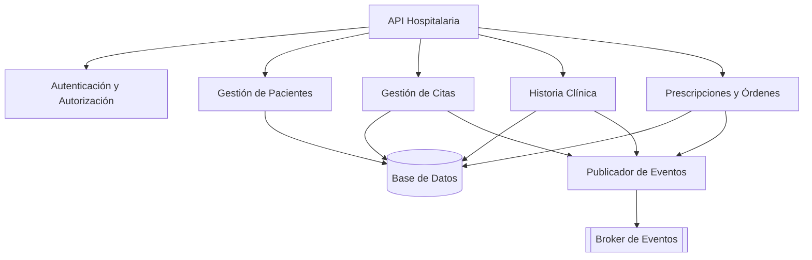

# MediConnect Plus — Sistema de Gestión Hospitalaria

> **Conecta tu atención. Simplifica tu salud.**

MediConnect Plus es un Sistema de Gestión Hospitalaria diseñado para digitalizar la gestión de pacientes, médicos, citas, historia clínica electrónica, prescripciones, órdenes médicas y procesos administrativos, con una arquitectura híbrida que combina comunicación síncrona para operaciones críticas y asíncrona mediante eventos para procesos secundarios.

---

## 📋 Tabla de Contenidos

1. [Descripción General](#descripción-general)
2. [Arquitectura](#arquitectura)
3. [Reglas de Negocio](#reglas-de-negocio)
4. [Modelo C4](#modelo-c4)
5. [UML y PlantUML](#uml-y-plantuml)
6. [API y Endpoints](#api-y-endpoints)
7. [Frontend / UX-UI](#frontend--ux-ui)
8. [ADR — Architecture Decision Records](#adr--architecture-decision-records)
9. [Taller Práctico — ADR-001](#taller-práctico--adr-001)
10. [Estructura del Proyecto](#estructura-del-proyecto)
11. [Tecnologías](#tecnologías)
12. [Evidencias](#evidencias)
13. [Equipo](#equipo)

---

## 📖 Descripción General

**MediConnect Plus** es un Sistema de Gestión Hospitalaria que permite:

- **Pacientes:** agendar/cancelar citas, consultar historial clínico autorizado, descargar recetas y resultados.
- **Médicos/Especialistas:** gestionar agenda, registrar Historia Clínica Electrónica (HCE), emitir prescripciones y órdenes médicas.
- **Personal Administrativo:** administrar agenda, admisión, validar convenios con EPS y coordinar facturación.

### Sistemas Externos

- **EPS / Aseguradoras:** validación de afiliación, cobertura y autorizaciones.
- **Laboratorios Externos:** recepción de órdenes y envío de resultados.
- **Proveedor de Notificaciones:** envío de correos, SMS y alertas.

---

## 🏗️ Arquitectura

MediConnect Plus utiliza una **arquitectura híbrida**:

### Núcleo Transaccional Síncrono

| Contenedor | Responsabilidad | Tecnología | Protocolo |
| :--- | :--- | :--- | :--- |
| Aplicación Web | Interfaz de usuario | SPA / PWA | HTTPS |
| API MediConnect Plus | Lógica de negocio | Node.js / Java | REST/JSON |
| Base de Datos | Persistencia transaccional | PostgreSQL | SQL (cifrado) |
| Caché | Acelerar consultas frecuentes | Redis | TCP/IP |

### Capa Asíncrona Orientada a Eventos

| Contenedor | Responsabilidad | Tecnología | Protocolo |
| :--- | :--- | :--- | :--- |
| Broker de Eventos | Distribución de eventos | RabbitMQ / Kafka | Mensajería |
| Servicio de Notificaciones | Procesar y enviar notificaciones | Microservicio | Eventos + HTTPS |
| Servicio de Integración | Comunicación con EPS y laboratorios | Microservicio | REST/FHIR/Webhooks |

---

## 📜 Reglas de Negocio

### Seguridad y Roles

| Código | Regla |
| :--- | :--- |
| RB01 | Todo usuario debe autenticarse antes de acceder a funciones protegidas. |
| RB02 | Los permisos dependen del rol: Paciente, Médico/Especialista o Personal Administrativo. |
| RB06 | Las funciones administrativas y clínicas deben estar protegidas mediante roles y permisos. |
| RB13 | Los datos clínicos deben mantenerse protegidos durante almacenamiento y transmisión. |

### Citas

| Código | Regla |
| :--- | :--- |
| RB03 | No se debe permitir reservar un espacio horario que ya esté ocupado. |
| RB04 | El paciente solamente puede consultar la información clínica para la cual tenga autorización. |
| RB07 | Una cita cancelada debe conservar trazabilidad del cambio. |
| RB08 | La creación de una cita debe ser confirmada antes de generar procesos secundarios. |
| RB09 | El envío de notificaciones no debe bloquear la creación de una cita. |

### Historia Clínica y Órdenes

| Código | Regla |
| :--- | :--- |
| RB05 | El médico solamente debe acceder a la información necesaria para desarrollar sus funciones. |
| RB10 | Las órdenes médicas deben estar asociadas a un paciente y a un profesional autorizado. |
| RB11 | Los resultados provenientes de laboratorios externos deben asociarse con la orden correspondiente. |

### Integración y Eventos

| Código | Regla |
| :--- | :--- |
| RB12 | Las integraciones con EPS y laboratorios deben utilizar interfaces controladas. |
| RB14 | Las acciones relevantes del sistema deben poder ser trazables para auditoría. |
| RB15 | Los eventos deben poder procesarse de manera segura evitando efectos incorrectos por duplicación. |
| RB16 | Una falla temporal de un servicio secundario no debe impedir, cuando sea posible, la operación clínica principal. |

---

## 🔷 Modelo C4

### Nivel 1 — Contexto

El sistema central es **MediConnect Plus**, rodeado de 3 actores y 3 sistemas externos.



### Nivel 2 — Contenedores



### Nivel 3 — Componentes (API MediConnect Plus)



---

## 📐 UML y PlantUML

Los diagramas UML del proyecto están disponibles en la carpeta `uml/`:

| Diagrama | Archivo | Descripción |
| :--- | :--- | :--- |
| Casos de Uso | `uml/casos_de_uso.puml` | Actores y funcionalidades del sistema |
| Clases | `uml/clases.puml` | Entidades del dominio |
| Secuencia — Agendar Cita | `uml/secuencia_cita.puml` | Flujo de agendamiento |
| Secuencia — Generar Orden | `uml/secuencia_orden.puml` | Flujo de prescripción |
| Actividad | `uml/actividad_cita.puml` | Proceso completo de cita |
| Componentes | `uml/componentes.puml` | Componentes de la API |
| Despliegue | `uml/despliegue.puml` | Infraestructura física |
| Estados | `uml/estados_cita.puml` | Ciclo de vida de una cita |

---

## 🌐 API y Endpoints

### Endpoints Principales

| Método | Ruta | Descripción | Componente C4 |
| :--- | :--- | :--- | :--- |
| POST | `/api/v1/auth/login` | Inicio de sesión | Autenticación |
| GET | `/api/v1/pacientes/{id}` | Obtener paciente | Gestión de Pacientes |
| POST | `/api/v1/citas` | Agendar cita | Gestión de Citas |
| GET | `/api/v1/citas/disponibilidad` | Consultar disponibilidad | Gestión de Citas |
| POST | `/api/v1/hce` | Crear registro en HCE | Historia Clínica |
| POST | `/api/v1/ordenes` | Generar orden médica | Prescripciones y Órdenes |
| POST | `/api/v1/eventos` | Publicar evento (interno) | Publicador de Eventos |

### Ejemplo de Contrato

```json
POST /api/v1/citas
{
  "idPaciente": "uuid",
  "idMedico": "uuid",
  "fecha": "2026-10-15T10:30:00Z"
}

Response 201:
{
  "idCita": "uuid",
  "estado": "confirmada",
  "fecha": "2026-10-15T10:30:00Z"
}
```

---

## 🎨 Frontend / UX-UI

### Identidad Visual

- **Colores:** Azul oscuro (#062B49), Azul claro (#0878B8), Cian (#79D8F5), Menta (#40D5C0), Blanco (#FFFFFF), Azul hielo (#EEF9FC).
- **Tipografía:** Inter, Poppins o similar.
- **Estilo:** Glassmorphism, tarjetas con sombras suaves, gradientes, animaciones sutiles.
- **Diferenciación:** Sin cruces médicas, sin estetoscopios, sin azul genérico hospitalario.

### Pantallas

| # | Pantalla | Descripción |
| :--- | :--- | :--- |
| 1 | Landing Page | Hero, beneficios, CTA, footer |
| 2 | Registro | Paciente / Profesional |
| 3 | Inicio de Sesión | Email, contraseña, recordar |
| 4 | Recuperación de Contraseña | Flujo seguro |
| 5 | Selección de Perfil | Paciente, Médico, Administrativo |
| 6 | Dashboard Paciente | Próxima cita, recetas, resultados |
| 7 | Dashboard Médico | Agenda del día, pacientes, HCE |
| 8 | Dashboard Administrativo | Agenda, admisiones, convenios |
| 9 | Agenda | Calendario y disponibilidad |
| 10 | Gestión de Citas | CRUD de citas |
| 11 | Historia Clínica | Registros médicos |
| 12 | Prescripciones | Recetas y órdenes |
| 13 | Órdenes Médicas | Exámenes y tratamientos |
| 14 | Notificaciones | Centro de mensajes |
| 15 | Perfil | Datos del usuario |
| 16 | Seguridad y Sesiones | Configuración de seguridad |
| 17 | Integraciones | Conexiones con EPS y laboratorios |
| 18 | Centro de Actividad / Auditoría | Registro de acciones |

---

## 📝 ADR — Architecture Decision Records

| ADR | Título | Estado |
| :--- | :--- | :--- |
| ADR-001 | Uso de Broker de Eventos para Comunicación Asíncrona | Aceptado |

### ADR-001: Broker de Eventos

**Contexto:** MediConnect Plus requiere que operaciones secundarias como notificaciones, integraciones con EPS y laboratorios, y auditoría no bloqueen las operaciones clínicas críticas.

**Decisión:** Se incorpora un **Broker de Eventos** (RabbitMQ o Kafka, pendiente de validación) como mecanismo de comunicación asíncrona.

**Consecuencias:**
- ✅ Mayor disponibilidad, escalabilidad, modificabilidad y trazabilidad.
- ⚠️ Mayor complejidad operativa, riesgo de duplicación (mitigado con idempotencia).
- 🔄 Política de reintentos y colas muertas pendiente de definición.

---

## 🎓 Taller Práctico — ADR-001

### Archivos del Taller

| Archivo | Descripción |
| :--- | :--- |
| `ADR-001-Broker-Eventos.md` | ADR redactado en Markdown |
| `ADR-001-Broker-Eventos.puml` | Diagrama PlantUML funcional |
| `PeerReview.md` | Rúbrica de revisión entre pares |

### Rúbrica de Peer Review

| Criterio | Descripción | Puntuación |
| :--- | :--- | :--- |
| Trazabilidad Funcional | El ADR conecta un requerimiento de negocio con la solución elegida. | ☒ Cumple / ☐ Mejora |
| Sintaxis PlantUML | El código `.puml` compila correctamente y representa la decisión. | ☒ Cumple / ☐ Mejora |
| Claridad en Consecuencias | Se identifican beneficios, riesgos y se justifica la decisión. | ☒ Cumple / ☐ Mejora |
| Referencia Cruzada | El Markdown referencia de manera unívoca al diagrama. | ☒ Cumple / ☐ Mejora |

---

## 📁 Estructura del Proyecto

```text
MediConnectPlus/
├── README.md
├── docs/
│   ├── ADR-001-Broker-Eventos.md
│   ├── PeerReview.md
│   └── Reglas_de_Negocio.md
├── uml/
│   ├── casos_de_uso.puml
│   ├── clases.puml
│   ├── secuencia_cita.puml
│   ├── secuencia_orden.puml
│   ├── actividad_cita.puml
│   ├── componentes.puml
│   ├── despliegue.puml
│   └── estados_cita.puml
├── frontend/
│   ├── index.html
│   ├── styles.css
│   └── app.js
├── api/
│   ├── openapi.yaml
│   └── endpoints.md
└── evidencias/
    ├── Análisis_Individual_R.T.pdf
    └── Modelado_Milton.pdf
```

---

## 🛠️ Tecnologías

| Capa | Tecnología | Justificación |
| :--- | :--- | :--- |
| Frontend | SPA / PWA | Experiencia moderna, offline-first |
| Backend | Node.js / Java | Decisión pendiente de validación grupal |
| Base de Datos | PostgreSQL | ACID, cifrado en reposo |
| Caché | Redis | Lecturas de alta frecuencia |
| Broker | RabbitMQ / Kafka | Comunicación asíncrona |
| Autenticación | JWT + RBAC/ABAC | Seguridad por roles |
| Interoperabilidad | HL7 FHIR R4 | Estándar clínico |
| Protocolos | HTTPS/TLS, REST/JSON, SQL, Webhooks | Comunicación segura |

---

## 📎 Evidencias

- **Anexo 1:** Borrador individual de Raúl Andrés Triana Ortega (`Análisis Individual R.T.pdf`).
- **Anexo 2:** Borrador individual de Milton César Machado Baneto (`Modelado y Diseño Arquitectónico con el Modelo C4.pdf`).
- **Anexo 3:** Diagramas Mermaid (Nivel 1, 2 y 3) incluidos en este documento.
- **Anexo 4:** Matriz de interfaces y contratos de API.
- **Anexo 5:** ADR-001 y Peer Review del taller práctico.

---

## 👥 Equipo

| Nombre | Rol |
| :--- | :--- |
| Milton César Machado Baneto | Arquitecto de Software |
| Raúl Andrés Triana Ortega | Arquitecto de Software |
| Santiago Molina Maldonado | Arquitecto de Software |

**Tema:** Redacción y revisión entre pares de decisiones arquitectónicas con PlantUML.  
**Fecha:** Octubre 2026

---

## 📄 Licencia

Proyecto académico — MediConnect Plus © 2026
